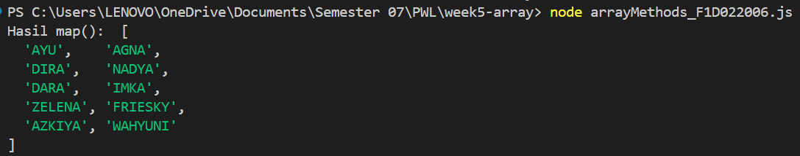
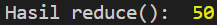
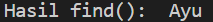
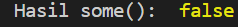
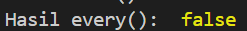

# PWL Tugas 2 Week 5 - JavaScript Array Methods

## Identitas
- **Nama** : Gusti Ayu Devi Anjani Putri
- **NIM**  : F1D022006

---

## Deskripsi Tugas
Pada tugas ini, mahasiswa diharapkan mampu menggunakan 6 metode array, yaitu: `map`, `filter`, `reduce`, `find`, `some`, dan `every`.

---

## Implementasi

---

### 1. map()
**Tujuan:**  
Tujuan dari penggunaan metode map() ialah untuk mengubah seluruh elemen dalam array menjadi bentuk baru tanpa mengubah jumlah elemennya; pada code saya, saya mengubah elemen yang ada dalam array menjadi huruf besar/kapital.

**Screenshot:**  

---

### 2. filter()
**Tujuan:**  
Tujuan dari penggunaan metode filter() ialah untuk mengambil elemen sesuai filter(kondisi/logika) yang kita inginkan; di code saya, saya mengambil elemen yang panjangnya lebih dari 5 huruf.

**Screenshot:**  

---

### 3. reduce()
**Tujuan:**  
Tujuan dari penggunaan metode reduce() ialah untuk menggabungkan seluruh elemen array menjadi satu nilai akhir dengan proses perhitungan berulang; di code saya, saya menjumlahkan tiap karakter pada tiap elemen dalam array.

**Screenshot:**  

---

### 4. find()
**Tujuan:**  
Tujuan dari penggunaan metode find() ialah untuk mencari dan mengembalikan elemen pertama dalam array yang memenuhi kondisi tertentu; di code saya, saya mencari elemen pertama yang dimulai dari huruf A.

**Screenshot:**  

---

### 5. some()
**Tujuan:**  
Tujuan dari penggunaan metode some() ialah untuk memeriksa apakah setidaknya ada satu elemen dalam array memenuhi kondisi tertentu, lalu menghasilkan nilai true atau false; di code saya, saya memeriksa apakah ada nama yang memiliki karakter lebih dari 10.

**Screenshot:**  

---

### 6. every()
**Tujuan:**  
Tujuan dari penggunaan metode reduce() ialah untuk memeriksa apakah seluruh elemen dalam array memenuhi kondisi tertentu, lalu menghasilkan nilai true atau false; di code saya, saya memeriksa apakah panjang semua nama lebih dari 3 huruf.

**Screenshot:**  

---

## Kesimpulan
Dari penggunaan berbagai metode array pada JavaScript, dapat disimpulkan bahwa setiap metode memiliki fungsi dan tujuan yang berbeda sesuai kebutuhan pengolahan data. 
- Metode map() digunakan untuk melakukan pengubahan pada setiap elemen array tanpa mengubah jumlah elemen. 
- Metode filter() berfungsi untuk mem-filter elemen-elemen tertentu berdasarkan kondisi yang diberikan sehingga menghasilkan array baru. 
- Metode reduce() digunakan untuk menggabungkan seluruh elemen menjadi satu nilai akhir seperti total atau akumulasi.
- Metode find() digunakan untuk mencari satu elemen pertama yang memenuhi suatu kondisi
- Metode some() dapat memeriksa apakah terdapat minimal satu elemen yang sesuai dengan kondisi tertentu
- Metode every() digunakan untuk memastikan apakah seluruh elemen memenuhi kondisi yang diberikan.
Melalui tugas ini, dapat dipahami bahwa JavaScript menyediakan berbagai metode array yang sangat membantu dalam pengolahan data secara efisien dan lebih mudah dibaca. Pemilihan metode yang tepat akan mempermudah proses analisis, manipulasi, maupun validasi data dalam berbagai aplikasi.
